# MySQL Comparison Between VM (Self-Managed) and Managed

## Recording
Zoom recording <https://drive.google.com/file/d/1YrShTNury2OcN9os2KZFit4i7jcH5tVG/view?usp=sharing>

## Chosen platform
I used Google Cloud platform to create the VM and the Cloud SQL database.

## VM
### VM creation
1. Select instance to create.
2. Choose E2 for price and usability.
3. Choose e2-small for minimum of 2GB of memory.
4. Choose Ubuntu OS system.
5. Everything else kept to default.

## Firewall configuration
1. Create a firewall rule and name it.
2. Set IP range to 0.0.0.0/0 to allow all IPs.
3. Allow all instances to this network under Tags. 
4. For protocol, check off TCP and enter 3306.

## SSH steps
1. Input `sudo apt-get update` to update the OS system.
2. Input `sudo apt install mysql-server mysql-client` to install mysql into the server.
3. Input `sudo mysql` to log in into mysql.
4. Input `CREATE USER 'xxx'@'%' IDENTIFIED BY 'xxx';` to add user to database
5. Input `GRANT ALL PRIVILEGES ON *.* TO 'xxx'@'%' WITH GRANT OPTION;` to give all privileges to the user.
6. Edit mysqld.cnf file and replace the defaults to `0.0.0.0/0` to allow for other network connections.
7. Restart SSH and input `mysql -u xxx -p` to locally test the user connection to mysql.
8. Input your password. 

Secrets can be stored in an .env file

## Managed Cloud SQL
### Cloud SQL
1. Select to create a sandbox MySQL instance.
2. Name instance and set a password.
3. Select a region press create.

### Configuration
1. Add `0.0.0.0/0` to authorized networks.
2. Disable SSL only connection for security.
3. Add a new user with a username and set a password for it.

DB_HOST, DB_PORT, DB_USER=class_user, DB_PASS, DB_NAME information can be stored in an .env file

## Screenshots
### VM 
Running VM
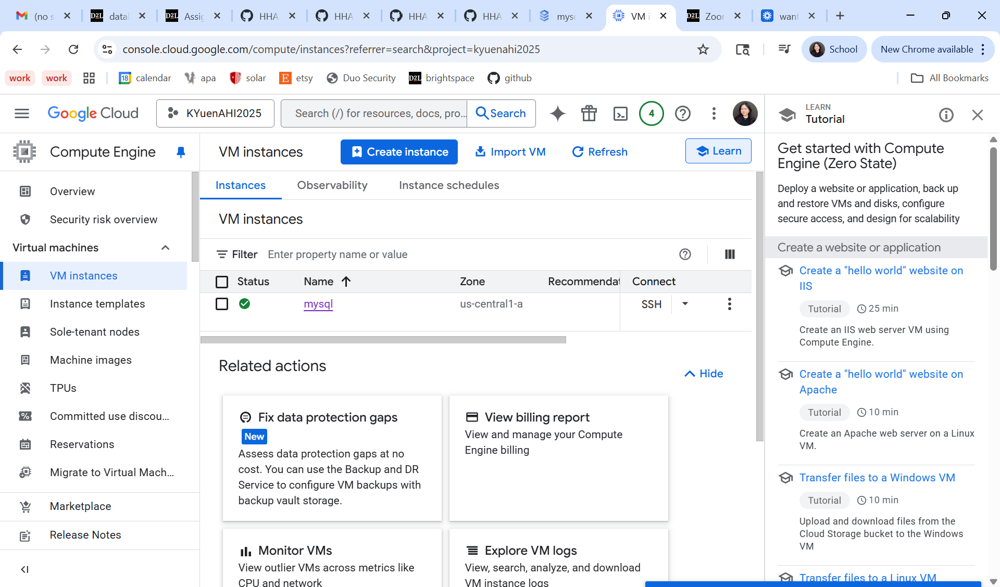

VM configuration
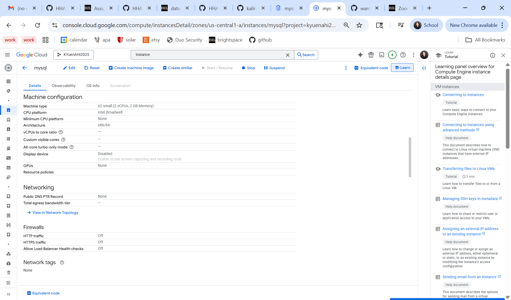
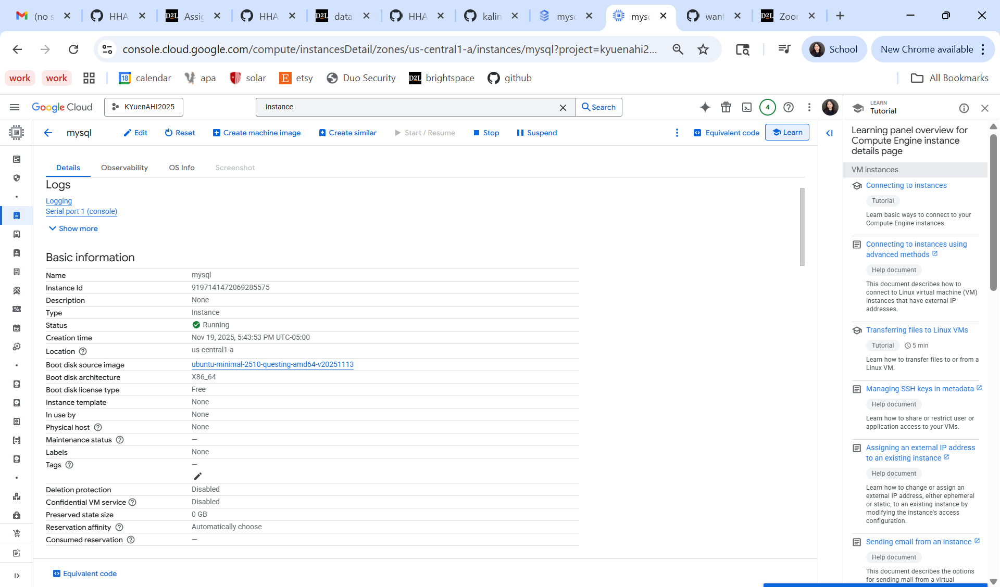

SSH connection to MySQL
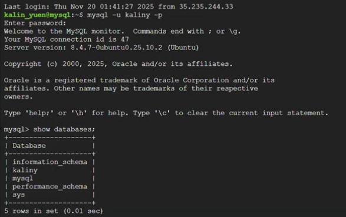

Python script results
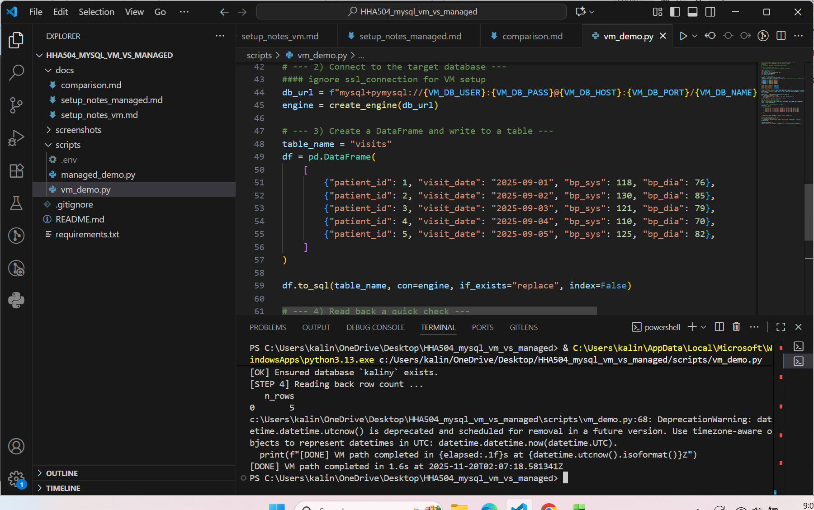

VM query
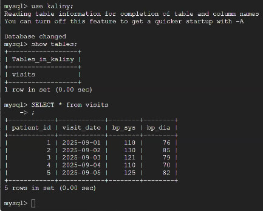

### Managed
Running Managed
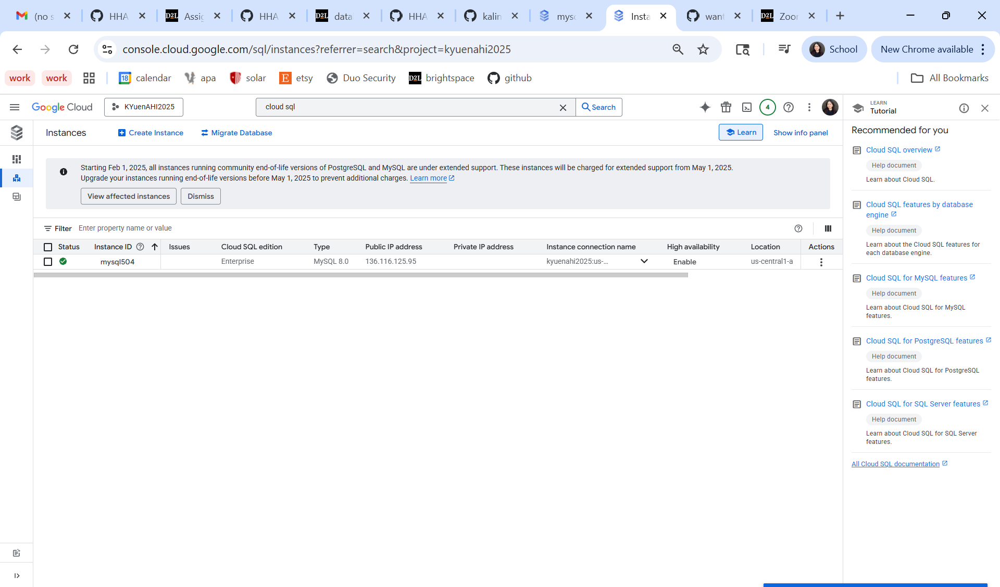

Managed network and security
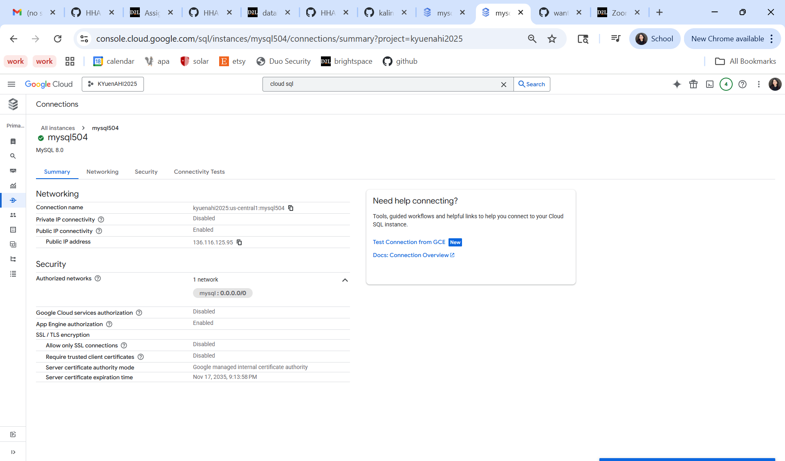
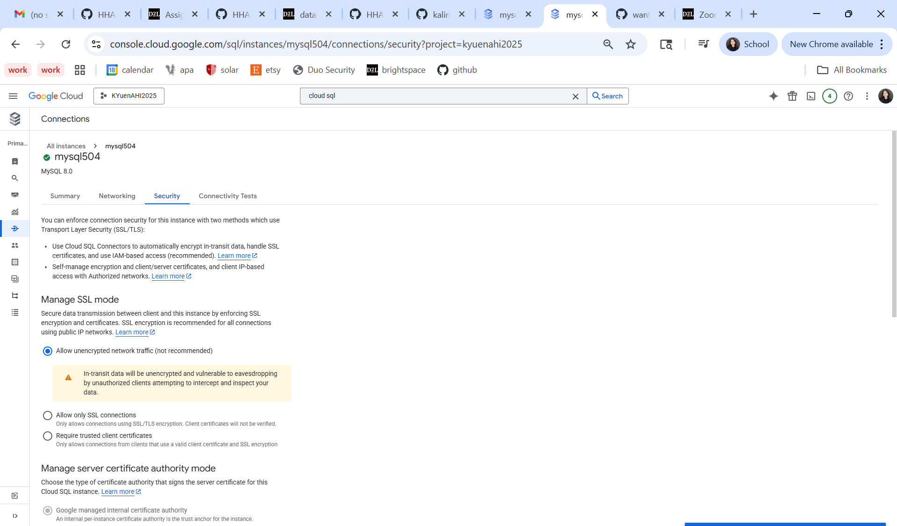

Python script results
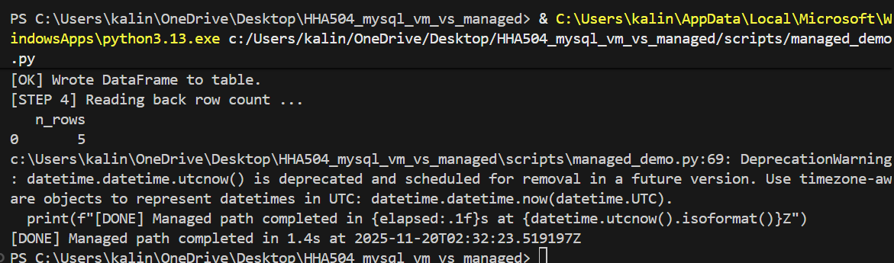

Managed query
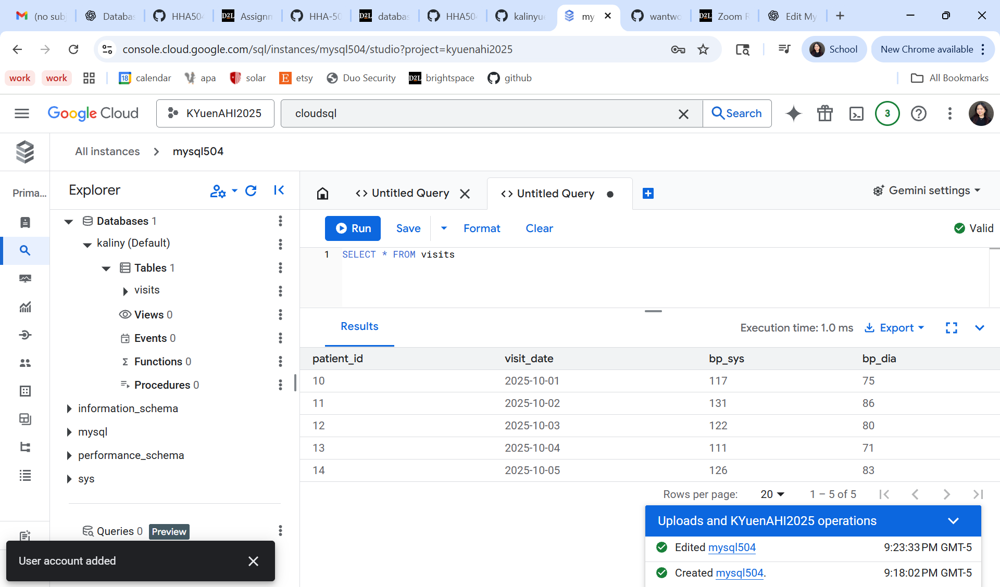